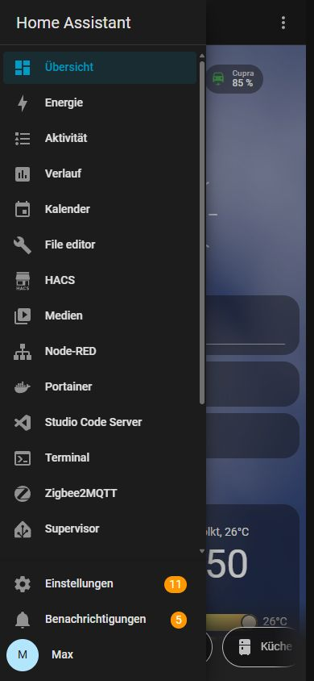

# Home Assistant auf dem iPhone bedienen

Diese Anleitung ist für das iPhone im Hochformat geschrieben. Die Bilder zeigen die echte dunkle Oberfläche unserer Instanz.

## Seitenleiste öffnen und Seiten finden

Tippe oben links auf das Menüzeichen. Die Seitenleiste enthält die normalen Alltagsseiten oben, technische Werkzeuge in der Mitte und dein Profil sowie Einstellungen unten.

  
  1
  2
  3
  4

<ol class="step-legend">
  <li><strong>Übersicht</strong> ist die wichtigste Alltagsseite. <strong>Karte</strong> und weitere Dashboards findest du weiter unten, wenn du in der Seitenleiste scrollst.</li>
  <li><strong>Energie, Aktivität, Verlauf und Kalender</strong> sind Auswertungen und Nachschlagebereiche.</li>
  <li><strong>Einstellungen</strong> ist die Verwaltung. Im Alltag brauchst du sie normalerweise nicht.</li>
  <li>Ganz unten steht dein eigenes Profil. Dort lassen sich Sprache, Darstellung und App-Einstellungen ändern.</li>
</ol>

Technische Einträge wie File editor, HACS, Node-RED, Portainer, Studio Code Server, Terminal oder Zigbee2MQTT sind Wartungswerkzeuge für Max. Öffnen allein ist harmlos; dort bitte nichts speichern, installieren, löschen oder neu starten.

!!! info "Zum Bild"
    Der Screenshot wurde mit Max’ Verwaltungsbenutzer aufgenommen. Bei Meike steht unten entsprechend **Meike**; außerdem können technische Einträge und orange Zähler fehlen. Diese Zähler sind offene Wartungs- beziehungsweise Benachrichtigungshinweise für Max, kein Hausalarm.

## Antippen, halten und schieben

- **Kurzes Antippen auf eine Kachel:** schaltet eine eindeutige Funktion oder öffnet weitere Details.
- **Antippen des Namens oder Symbols:** öffnet bei vielen Kacheln die Detailansicht.
- **Schieberegler:** verändert Helligkeit oder Lautstärke sofort.
- **Drei Punkte oben rechts:** öffnet das Menü der aktuellen Seite. „Dashboard bearbeiten“ ist Wartung, keine Alltagsbedienung.

Ein großer Ein-/Aus-Schalter ändert den Zustand sofort. Ein Helligkeits- oder Lautstärkeregler wirkt ebenfalls unmittelbar. Das Drei-Punkte-Menü kann technische Informationen und Verwaltungsfunktionen enthalten: Nachsehen ist in Ordnung, Löschen oder Neu-Konfigurieren nicht.

## Räume öffnen

Am unteren Rand der Übersicht stehen die Räume. Ein Tipp auf **Wohnzimmer**, **Küche**, **Kinderzimmer** und so weiter öffnet ein Fenster mit den Geräten dieses Raums.

Oben im geöffneten Fenster steht der gewählte Raum. Darunter zeigen Sensoren je nach Ausstattung Temperatur, Feuchtigkeit, Bewegung oder Anwesenheit. Unter „Lampen“ lassen sich einzelne Lichter bedienen; unter „Sonstiges“ folgen Mediengeräte oder weitere Raumfunktionen.

## Benachrichtigungen

Home Assistant sendet unter anderem Erinnerungen, Geräte-fertig-Meldungen und Sicherheitszusatzmeldungen. Eine Push-Nachricht kann verspätet sein oder ausbleiben. Waschmaschine, Rauchmelder, Tür oder Wallbox deshalb bei wichtigen Situationen direkt prüfen.

## Wo finde ich was?

| Gesucht | Seite |
|---|---|
| Licht, Räume, Türen/Fenster, Batterien, Wetter | **Übersicht** |
| Aktueller Cupra-Ladestand | **Übersicht** |
| Ladesitzungen, Energieanteile und Kosten des Cupra | **Cupra Laden** |
| Standort von Max und Meike | **Karte** |
| Stromverbrauch und Energieverlauf | **Energie** |
| Frühere Zustände eines Geräts | **Verlauf** |
| Was Home Assistant kürzlich getan hat | **Aktivität** |
| Termine | **Kalender** |
| Geräte, Automationen, Backups, Cloud | **Einstellungen** |

Weitere Einzelheiten: [Einstellungen verstehen](einstellungen.md) und [alle Dashboards](../dashboards/index.md).

Bedienungsanleitung geprüft am 18. Juli 2026

