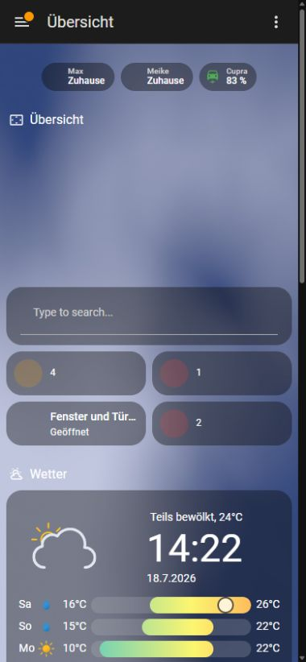

# Hier starten, Meike

Hallo Meike! Home Assistant ist die gemeinsame Bedienoberfläche für Licht, Räume, Tür- und Fensterzustände, Geräte, Wetter und einige Erinnerungen. Du kannst im Alltag wenig kaputt machen: normales Antippen öffnet meist nur eine Detailansicht oder schaltet eine klar bezeichnete Funktion.

## Die drei wichtigsten Dinge

1. Öffne in der iPhone-App zuerst **Übersicht**.
2. Tippe bei einem Raum unten auf den Raumnamen, wenn du einzelne Lampen oder Geräte sehen möchtest.
3. Wenn etwas unerwartet aussieht, nutze zuerst den normalen Schalter. Lösche oder kopple kein Gerät neu.

  
  1
  2
  3

<ol class="step-legend">
  <li>Oben stehen Max, Meike und der aktuelle Ladestand des Cupra. Der Personenstatus ist eine Standortschätzung des jeweiligen iPhones.</li>
  <li>Die linke Zahl zeigt eingeschaltete Lichter. Antippen öffnet die betroffenen Lampen.</li>
  <li>Die roten beziehungsweise gelben Felder zeigen offene Schlösser, offene Türen/Fenster oder niedrige Batterien.</li>
</ol>

## Was darf ich bedenkenlos bedienen?

- Lampen ein- und ausschalten oder ihre Helligkeit ändern
- Raumansichten öffnen
- Wetter, Strom, Hausgeräte und Cupra-Werte ansehen
- Szenen wie „Filmabend“ starten, wenn die Wirkung klar ist
- eine Push-Nachricht als erledigt bestätigen

Bei **Türschloss, Türöffner, Wasserventil, Wallbox oder sicherheitsrelevanten Meldungen** zuerst kurz prüfen, was vor Ort tatsächlich passiert. Ein App-Zustand ersetzt nie den Blick auf Tür, Fahrzeug oder Gerät.

## Dein eigener Benutzer

Du meldest dich mit deinem eigenen Home-Assistant-Benutzer an. Dadurch bleiben persönliche Einstellungen, App-Verbindung, Standort und Benachrichtigungen sauber von Max getrennt. Unten in der Seitenleiste siehst du dein Profil. Wenn dort versehentlich „Max“ steht, bitte nicht weiter konfigurieren, sondern Max Bescheid sagen.

## Von unterwegs

Die Home-Assistant-App funktioniert von unterwegs über **Home Assistant Cloud**. Das Wiki selbst ist vorerst nur zu Hause im WLAN erreichbar. Wenn Home Assistant unterwegs nicht lädt, zuerst Mobilfunk/WLAN prüfen und die App einmal neu öffnen.

## Wenn etwas nicht klappt

1. Normalen Schalter oder die direkte Gerätebedienung versuchen.
2. Prüfen, ob nur ein Raum oder das ganze Haus betroffen ist.
3. Uhrzeit, Raum und sichtbare Meldung notieren oder einen Screenshot machen.
4. In der [Schnellhilfe](../schnellhilfe/index.md) nachsehen oder Max informieren.

!!! danger "Bei echter Gefahr"
    Bei Rauch, Feuer, Gasgeruch, Einbruch oder medizinischem Notfall nicht zuerst Home Assistant untersuchen. Menschen in Sicherheit bringen und den passenden Notruf wählen.

Als Nächstes: [Home Assistant Schritt für Schritt bedienen](../bedienung/index.md).

Persönliche Einstiegshilfe geprüft am 18. Juli 2026

